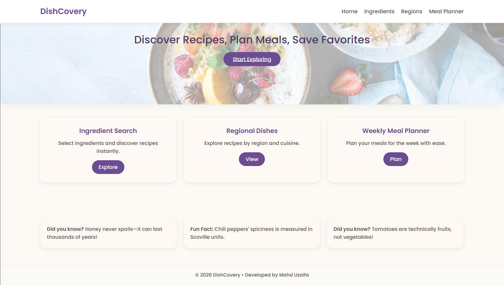
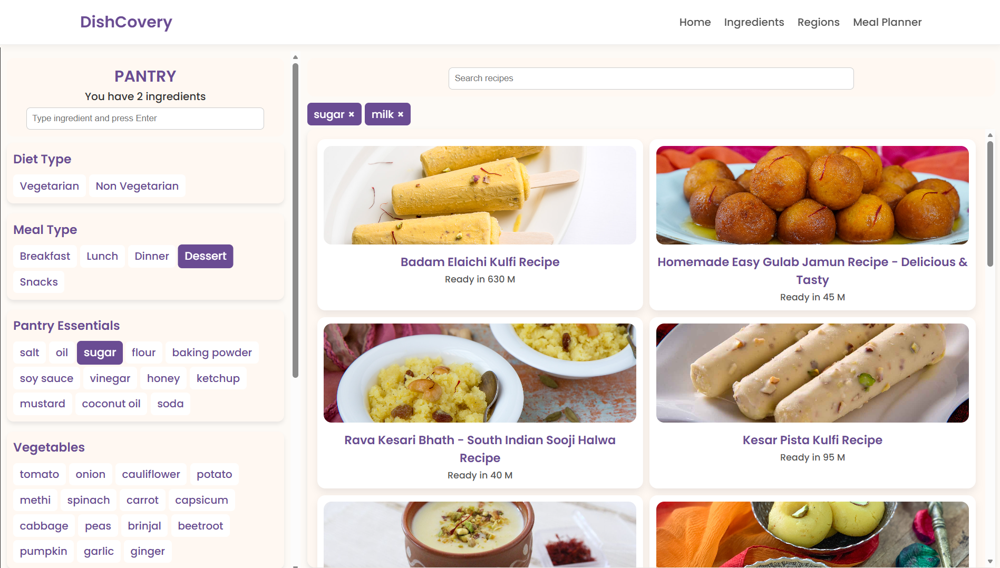
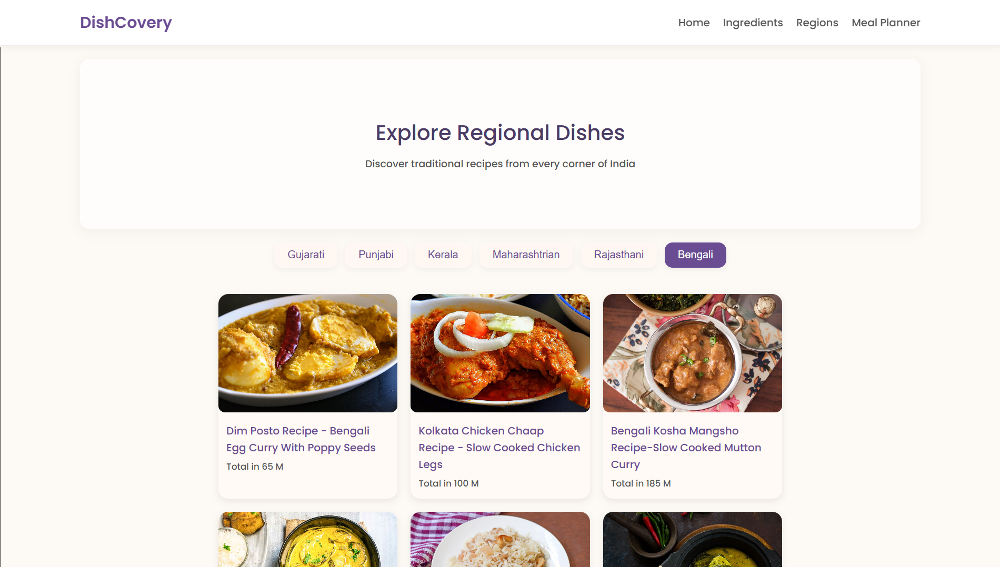
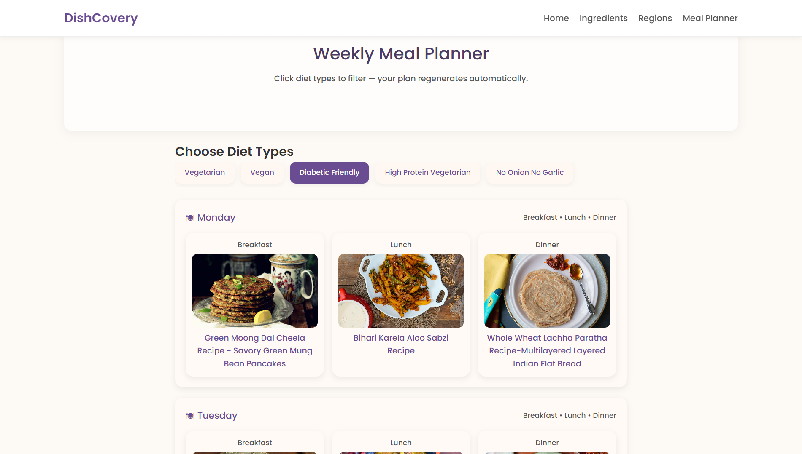
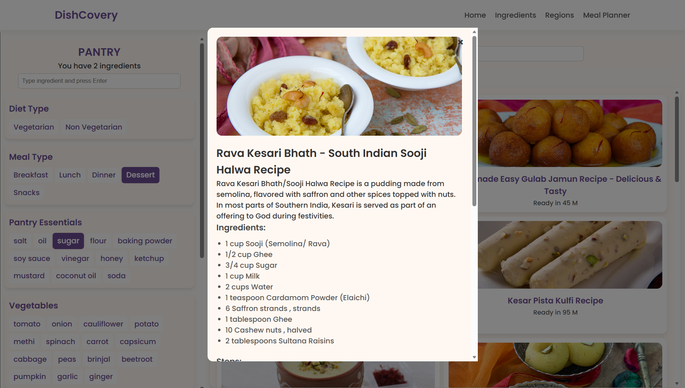

# 🍽️ DishCovery


DishCovery is a full-stack recipe discovery web application that helps users search recipes using available ingredients, explore regional cuisines, and generate personalized weekly meal plans. The application is powered by a Spring Boot REST API, MySQL database, and Cloudinary-hosted images.

---

## 🌐 Live Demo

**Frontend:** https://dishcovery-frontend-6eyo.onrender.com

**Backend API:** https://dishcovery-backend-tprd.onrender.com/api/recipes

---

## ✨ Features

* 🔍 Search recipes using available ingredients
* 🥗 Filter recipes by diet type
* 🍛 Explore recipes from different regional cuisines
* 📅 Generate weekly meal plans based on dietary preferences
* 📖 View detailed recipe information including:

  * Ingredients
  * Cooking instructions
  * Description
  * Preparation time
* ⚡ Fast loading using browser session storage caching
* ☁️ Recipe images served through Cloudinary CDN
* 📱 Responsive user interface

---

## 🛠️ Tech Stack

### Frontend

* HTML5
* CSS3
* JavaScript (ES6)

### Backend

* Java
* Spring Boot
* Spring Data JPA

### Database

* MySQL (Aiven Cloud)

### Image Hosting

* Cloudinary

### Deployment

* Render (Frontend)
* Render (Backend)

---

## 📊 Dataset

* **4,466 recipes**
* Original dataset sourced from Kaggle
* Converted from CSV to JSON
* Imported into MySQL database
* Recipe images uploaded and hosted on Cloudinary

---

## 🏗️ Project Architecture

```text
                User
                  │
                  ▼
      Frontend (Render)
                  │
          REST API Requests
                  │
                  ▼
   Spring Boot Backend (Render)
                  │
          Spring Data JPA
                  │
                  ▼
       MySQL Database (Aiven)
                  │
        Cloudinary Image URLs
                  │
                  ▼
      Cloudinary CDN (Images)
```

---

## 🚀 Running the Project Locally

### Clone the Repository

```bash
git clone https://github.com/mohd-uzaifa/dishcovery.git
```

### Backend

Configure the following environment variables:

```properties
DB_URL=
DB_USERNAME=
DB_PASSWORD=
```

Run the Spring Boot application.

### Frontend

Open the frontend using VS Code Live Server or any local web server.

---

## 📂 Project Structure

```text
DishCovery/
│
├── backend/
│   ├── src/main/java/com/project/dishcovery/
│   │   ├── CorsConfig.java
│   │   ├── DataLoader.java
│   │   ├── DishcoveryApplication.java
│   │   ├── Recipe.java
│   │   ├── RecipeController.java
│   │   ├── RecipeRepository.java
│   │   ├── RecipeService.java
│   │   ├── RecipeSummaryDTO.java
│   │   └── StringListJsonConverter.java
│   │
│   ├── src/main/resources/
│   ├── Dockerfile
│   └── pom.xml
│
├── ingredient-search/
├── regional-dishes/
├── meal-planner/
│
├── index.html
├── script.js
├── style.css
│
├── screenshots/
│
└── README.md
```
---

## 📸 Screenshots

### 🏠 Home Page



### 🥕 Ingredient Search



### 🍛 Regional Dishes



### 📅 Weekly Meal Planner



### 📖 Recipe Details



---

## 🔮 Future Enhancements

* 👤 User authentication
* 🤖 AI-powered recipe recommendations
* 🥦 Nutrition information
* 🛒 Shopping list generation
* ⭐ Recipe ratings and reviews
* 📤 Recipe sharing

---

## 👨‍💻 Developer

Developed by **MOHD UZAIFA**

GitHub: https://github.com/mohd-uzaifa

---

## 📄 License

This project was developed as a portfolio and educational project to demonstrate full-stack web development using Spring Boot, MySQL, Cloudinary, and Render.